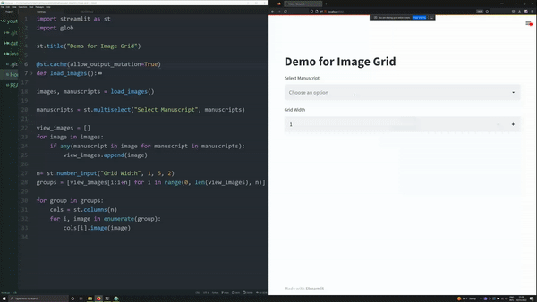

# About the Repository

This repository houses the code used to create an easy-to-manipulate image grid in Streamlit. The images used in this repository are medieval manuscripts and were gathered from [E-Codices](https://www.e-codices.unifr.ch/en).

Video link: https://youtu.be/x8C8IMqHxFA

# Citation to Images
For a complete citation to all images used in this repository, see `data/citation.md`.
